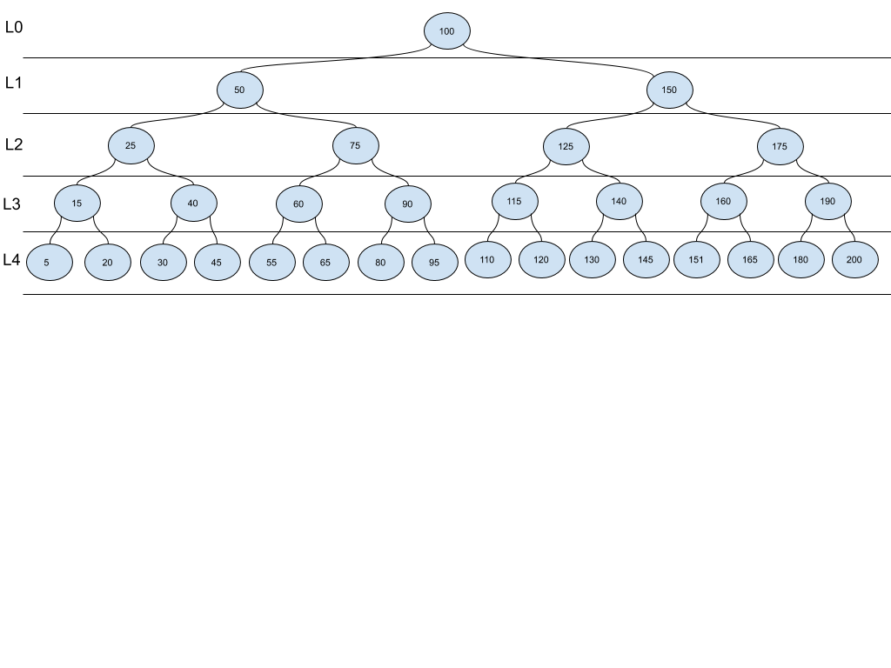

[Table of Contents](../../README.md)


# Problem First Common Ancestor 4.8

[Whiteboard approach](https://docs.google.com/document/d/1lbisGeZwOLpngQqzG_mhX9kKw0epUCVpES2uxtRJmcw/edit?usp=sharing)

### PROBLEM DOMAIN
- Design an algorithm and write the code to find the first common ancestor of two nodes in a binary tree. Avoid storing additional nodes in the data structure. NOTE: This is not necessarily a binary search tree.

### VISUALS


INPUT: 20 and 60
OUTPUT: 50

INPUT: 75 and 140
OUTPUT: 100

INPUT: 160 and 190
OUTPUT: 175

### EDGE CASES
- The root is a common ancestor but is the last one, I need to find the first ancestor from bottom to top.
- The input nodes can be in a different subtree.
- The ancestor can be n level up.
- Inputs and can be at different levels and subtrees.
- I can assume I have classes to the node and tree
- What happens when one node is the root?

### ALGORITHMS

#### APPROACH 1

```
create a function that receives two nodes: first_common_ancestor(node_a, node_b)
	call helper function get_path(node_a) and store in path_a (return a list)
	call helper function get_path(node_b) and store in path_b (return a list)
	create a loop for len(path_a)
		check if path_a[i] in path_b
			if exist, return path_a[i]algo

```


#### TESTS
```
INPUT: 20 and 40
path_a:  20, 15, 25, 50, 100
path_a: 40, 25, 100

OUTPUT: 50
```


#### BIG O
**Time O(Logn):** I need to loop in a part of the tree.

**Space O(Logn):** I need to create a list of variable space, but not as big as N.

______

#### APPROACH 2 NODES HAVE PARENT REFERENCE. Starting on node_a.parent, compare all node_b parents, if I didn't find it, move to next parent on node_a and start the comparation against node_b, until I find the common ancestor.

### CODE
[cracking_practices/first_common_ancestor/first_common_ancestor.py](first_common_ancestor.py)


### TESTS
[tests/test_first_common_ancestor.py](../../tests/test_first_common_ancestor.py)

### GITHUB BRANCH

[Pull Request # 29, Branch: first_common_ancestor](https://github.com/ilealm/cracking-practices/pull/29)
