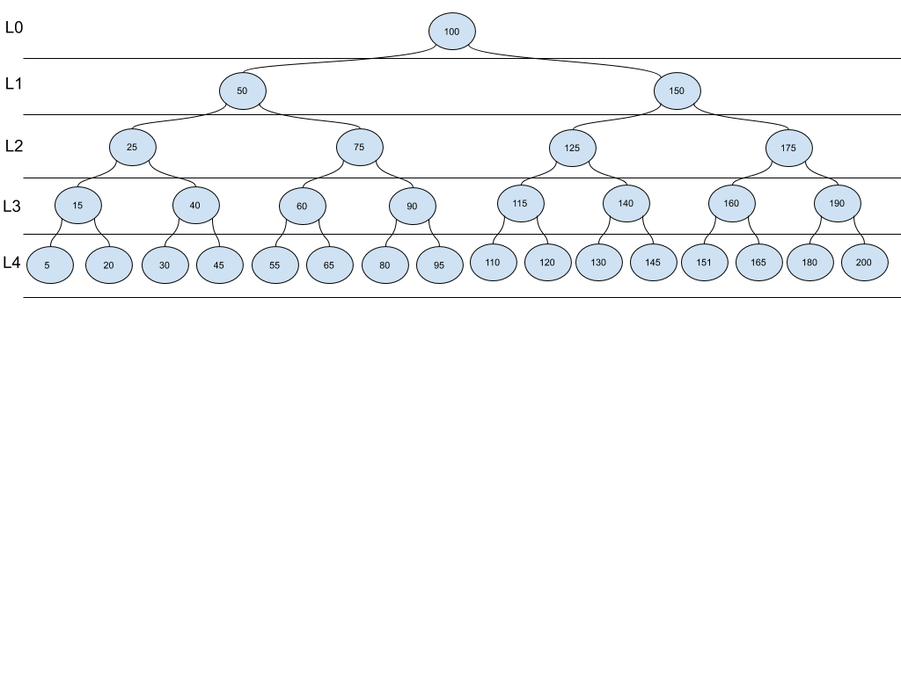

[Table of Contents](../../README.md)


# Problem Get Node Path

[Whiteboard approach](https://docs.google.com/document/d/1N9eIXwS-EH7bRI-EMZ-AbvZUjuahTGyyHaV02HJZUF4/edit?usp=sharing)

### PROBLEM DOMAIN
Write a function that returns in a list the path of a node in the tree, from the lower level to root. It receives a tree and a node, to search its value in the tree. * It can return a Stack() object if required.

### VISUALS


INPUT: 20
OUTPUT: [15, 25, 50, 100]


INPUT: 90
OUTPUT: [75, 50, 100]

INPUT: 145
OUTPUT: [140, 125, 150, 100]

INPUT: 200
OUTPUT: [190, 175, 150, 100]

INPUT: None
OUTPUT: []


### EDGE CASES
- This is not necessarily a binary search tree.


### ALGORITHMS

```
create a function get_node_path which receives a tree and a node
	declare return_stack list and set to empty
declare variable founded and set to False

add basic validations to the input

create inner function traverse which receives a current node and node to search
declare founded as nonlocal
	if founded is True, return
	if not current, return

		insert in the top of return_stack the value of current.value

      if current.value is equal target.value
set founded = True and
           return

       	if current.left have left,
           if not current.left.value is equal to target.value
               call traverse(current.left, target)
           else
               set founded = True
               return

		do the same for the left

       if not founded:
           pop the top of return_stack

   traverse(tree.root, node)
   return return_stack
```


#### BIG O
**Time O(n):** I need to traverse all the tree until I find the node.

**Space O(1):** I'm not creating a new ds.

### CODE
[cracking_practices/test_get_node_path/test_get_node_path.py](test_get_node_path.py)


### TESTS
[tests/test_test_get_node_path.py](../../tests/test_test_get_node_path.py)

### GITHUB BRANCH

[Pull Request # 29, Branch: first_common_ancestor](https://github.com/ilealm/cracking-practices/pull/29)
