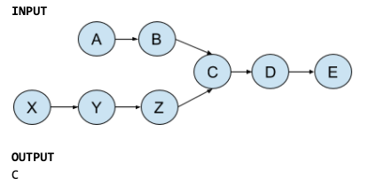

[Table of Contents](../../README.md)

# Problem 2.7 : Interseccion

[Whiteboard approach](https://docs.google.com/document/d/14kCqRljVhyKKnvHYCEzx0PcUlyZYNrTUrOxKbxMLrzU/edit?usp=sharing)

### PROBLEM DOMAIN
Given two singly linked list, determine if the two lists intersect. Return the intersecting node. Note that the intersection is based on reference, not value. That is, if the kth value node on the first ll is the exact same node (by reference) as the jth node on the second ll, then, they are intersecting.


### Visuals




### EDGE CASES
- Each ll can have any type of value.
- Each ll can have different lengths.
- There can't be an intersection.
- If the isn't an intersection, return False.
- Both linked lists have the same end nodes after the intersection.


### ALGORITHMS

#### APPROACH 1, Traverse ll one, and for each node, traverse the 2nd ll until finds the same list_one.current.next equal to a node on the second ll, or it reaches the end of the list.


```
create a function that receives 2 linked list (one_ll, two_ll).
add basic validations on the lls.
create a one_current variable and set to one_ll.head
create a two_current variable and and set to None
traverse while one_current is valid
 set to two_current to two_ll.head
		traverse while two_current is valid
			check if the node one_current is equal to two_current, if so:
				return one_current, and end of the function
		set two_current to two_current.next
		set one_current to one_current.next

	return False

```


#### TESTS
```
A -> B -> C -> D -> E -> NONE
                  1^
X -> Y -> Z -> C
               2^
```
one_current (1^):\
two_current (2^):\

#### BIG O
**Time O(m * n):** Because in the worst-case scenario I'm traversing both linked list.

**Space O(n):** Because I'm not creating a new data structure.

---------
#### APPROACH 2: Traverse all ll_one and store the nodes in a set. Then, traverse all the second list, if the current node (in the second list) exist in the set, there is the intersection, and I'm going to return that node.

```

create a function that receives 2 linked list (one_ll, two_ll).
add basic validations on the lls.
create a variable one_set and set to empty.
create a one_current variable and set to one_ll.head
traverse while one_current is valid
	insert one_current into the set
	move one_current to one_current.next

create a two_current variable and set to two_ll.head
traverse while two_current is valid
	check if two_current exists one_set, if so:
		return two_current
	move two_current to two_current.next

	return False
```

### TEST

```
A -> B -> C -> D -> E -> NONE
               			1^
X -> Y -> Z -> C
               2^

one_current (1^):
two_current (2^):
one_set= A, AB, ABC, ABCD, ABCDE
```
#### BIG O
**Time O(m + n):** Because in the worst-case scenario I'm traversing both linked list.

**Space O(m):**  Because I'm creating a new data structure with the copy of list one (m).

---------


### CODE
[cracking_practices/intersection/intersection.py](intersection.py)

### TESTS
[tests/intersection.py](../../tests/intersection.py)

### GITHUB BRANCH

[Pull Request # 4, Branch: intersection](https://github.com/ilealm/cracking-practices/pull/4)
