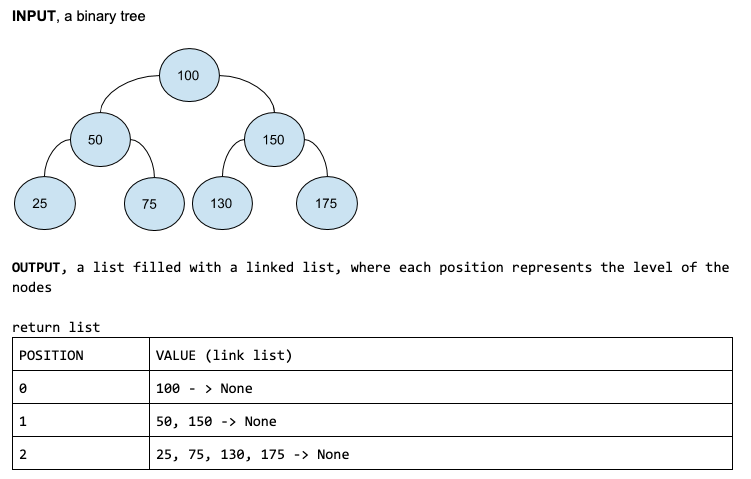

[Table of Contents](../../README.md)


# Problem List of Depths 4.3

[Whiteboard approach](https://docs.google.com/document/d/1wPAgmO2acxpVA_npTVuB1eoHkOanU11KIGkUfIcWHIk/edit?usp=sharing)

### PROBLEM DOMAIN

Given a binary tree, design an algorith which creates a link list of all the nodes at each level depth.
If you have a tree with deep D, you will have D linked list.

### INPUT




### EDGE CASES/ ASSUMPTIONS
- The tree can be N depth.
- The tree is a binary tree.
- The tree can have duplicates.
- The tree can be unbalanced.
- The order of the nodes on each level, must be the same order on the linked list.
- I can assume I have classes for Node, LinkedList, Tree, BinaryTree, Queue, collections.
- I can assume I have in linkedlist that I have a tail attribute, so I can append to it with time(1).


### ALGORITHMS

#### APPROACH 1, Implement 2 queues to keep track of the levels, and have a liked list where I append each node. When I change levels, I append the linkedlist into the list_list.

```
create a function that receives a tree
	add basic validation to the tree
	# declare variables
	return_List to empty list
liknedlist_level and set to LinkedList()
current_level and set to Queue()
next_level and set to Queue()

	enqueue on current_level, the tree.root

	create a loop while current_level is not empty
		dequeue current_level and set to front
		append into liknedlist_level: front.value

		check if front.left, then enqueue it into next_level
		check if front.right, then enqueue it into next_level

       	# check if I'm changing levels
     if current_level.is_empty, then
           append into return_List liknedlist_level
           reset liknedlist_level

           # swap queues to change the level
           current_level, next_level = next_level, current_level

   return return_List
```


#### TESTS
```
current_level = 100, 25, 75,125,175
next_level = 50, 150
front = 100, 50, 150, 25, 45, 125, 175
liknedlist_level = [100 -> None], [50 -> 150 -> None], [25 -> 75 -> 125 -> 175 -> None]
return_List = [100 -> None, 50 -> 150 -> None, 25 -> 75 -> 125 -> 175 -> None]
```


#### BIG O
**Time O(n):** Because I only traverse all the tree once.
**Space O(nLogn):** Because I have a ds with the same space of the tree, and I have a dsa helper.


### CODE
[cracking_practices/list_of_depths/list_of_depths.py](list_of_depths.py)


### TESTS
[tests/test_list_of_depths.py](../../tests/test_list_of_depths.py)

### GITHUB BRANCH

[Pull Request # 25, Branch: list_of_depths](https://github.com/ilealm/cracking-practices/pull/25)
