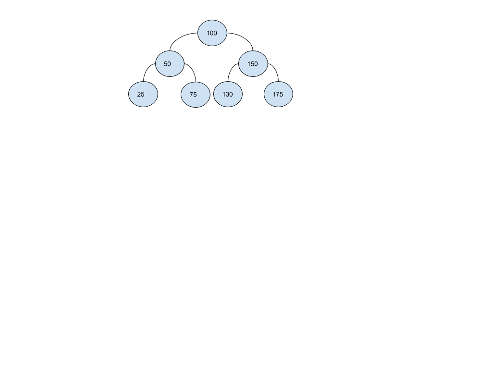

[Table of Contents](../../README.md)


# Problem 4.2

[Whiteboard approach](https://docs.google.com/document/d/1imHz4_QKa1nEJYe1B-1Ul_fVNTQlHkAsrEdxsWLLWiQ/edit?usp=sharing)

### PROBLEM DOMAIN
Given a sorted (increasing order) array with unique integer elements, white an algorithm to create a binary search tree with minimal height.

### INPUT
[25, 50, 75, 100, 130, 150, 175]

### OUTPUT



### EDGE CASES
- The list will be sorted in asc mode.
- I can assume I have a node, BST and queue class.
- The list represents a tree of any deep.
- The tree is a binary tree.
- The array doesn't have duplicated values.
- The tree can be unbalanced.


### ALGORITHMS

#### APPROACH 1
```
create a function that receives an array
	create a tree variable for a BST
		create an inside function which will be recursive, and accepts an sub_array  and tree
		add cases to exit recursion
       if len(sub_array) == 0 : return
		if len(sub_array) == 1,
add the value to the tree
           return

		obtain the middle position of the sub_array
		add to the tree the middle position
		recurse the left part of the sub_array
		recurse the right part of the sub_array


send the original array and tree to the recursive inside function

return tree


```


#### TESTS
```
[25, 50, 75, 100, 130, 150, 175]
[25, 50, 75]
[25]
[75]
[130, 150, 175]
[130]
[175]
[100, 50, 150, 25, 75, 130, 175]

tree: 100, 50, 25, 75, 150, 130, 175

```


#### BIG O
**Time O(n):** Because I'm traversing all the list.

**Space O(nLogn):** Because I'm creating a new DS (tree) and I'm creating a helper array.

### CODE
[cracking_practices/minimal_tree/minimal_tree.py](minimal_tree.py)


### TESTS
[tests/test_minimal_tree.py](../../tests/test_minimal_tree.py)

### GITHUB BRANCH

[Pull Request # 24, Branch: minimal_tree](https://github.com/ilealm/cracking-practices/pull/24)
