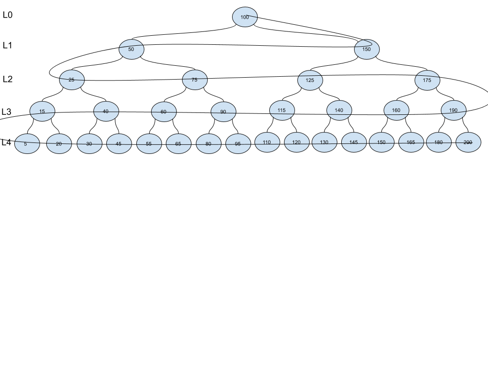

[Table of Contents](../../README.md)


# Problem: Binary Tree zig zag.

[Whiteboard approach](https://docs.google.com/document/d/1-9eUTuEyqJKBEYzV3OqvdquukBZkqu0e4SthqdJjUJw/edit?usp=sharing)

### PROBLEM DOMAIN
Having a binary search tree, return the values in a zig zag fashion.


### INPUT



### OUTPUT

[100, 150, 50, 25, 75, 125, 175, 190, 160, 140, 115, 90, 60, 40, 15, 5, 20, 30, 45, 55, 65, 80, 95, 110, 120, 130, 145, 150, 165, 180, 200]


### EDGE CASES
- The tree can be N levels.
- The tree can be unbalanced.
- All the nodes will be returned in the list.
- The value of the nodes are irrelevant.
- The zig-zag movement starts from the root to the right.
- I can assume I already have the class node, BST, binaryTree, and BreadthFirst.


### ALGORITHMS

#### APPROACH 1,BRUTE FORCE. Is NOT the most efficient way, but is the first approach.
- Traverse the tree in a breath way, save the traverse in a list, then move to that list and create a new list with the zipped values. Is NOT the most efficient way, but is the first approach.


```
create a function that receives a tree
implement basic validation on the tree
Call tree.breadthFirst to have all the tree values in a list (bf_list). I know which elements are in each level, using pow.

	# declare variables
	create zig_zag_list list and set to empty (here I will save the values of the traversing in zig-zag)
	create pointer variable and set to 0 (helper to move through the list)
create level variable and set to 0, (will tell me which level I'm now)
create variable starting_on_right and set to True, so I know which side to move.

	append the root into zig_zag_list
	move 1 position in pointer
	move 1 position in level

	create a loop, while len(zig_zag_list) is less than len(bf_list)
		calculate the possitions_to_move I need to move to left or right, by using pow(2, level)
validate if the possitions_to_move is less than the available elements in the bf_list, if so, recalculate possitions_to_move
		if starting_on_right:
			stablish the position on the right of the tree, where I'm moving to the left
			create a loop for the number of possitions to move
			append in zig_zag_list the right value from bf_list
				increase the ponter by one
			change flag starting_on_right to false
		else:
			create a loop for the number of possitions to move
append in zig_zag_list the right value from bf_list
				increase the ponter by one

			change flag starting_on_right to true

       increase level by 1


   return zig_zag_list


```


#### TESTS
```
bf_list =
[100, 50, 150, 25, 75, 125, 175, 15, 40, 60, 90, 115, 140, 160, 190, 5, 20, 30, 45, 55, 65, 80, 95, 110, 120, 130, 145, 150, 165, 180, 200]

level = 0,1,2,3,4
starting_on_right = T, F, T, F, T

zig_zag_list=
[100, 150, 50, 25, 75, 125, 175, 190, 160, 140, 115, 90, 60, 40, 15, 5, 20, 30, 45, 55, 65, 80, 95, 110, 120, 130, 145, 150, 165, 180, 200]

```


#### BIG O
**Time O(n2):** I'm traversing the tree to copy to a list, and then I move again trough the list.

**Space O(n2):** Because I'm reacting two new ds. (one to have the tree in breathFirst, and another to return the zig-zag)

### CODE
[cracking_practices/zig_zag_tree/zig_zag_tree.py](zig_zag_tree.py)


### TESTS
[tests/test_zig_zag_tree.py](../../tests/test_zig_zag_tree.py)

### GITHUB BRANCH

[Pull Request # 20, Branch: zig_zag_tree](https://github.com/ilealm/cracking-practices/pull/20)
